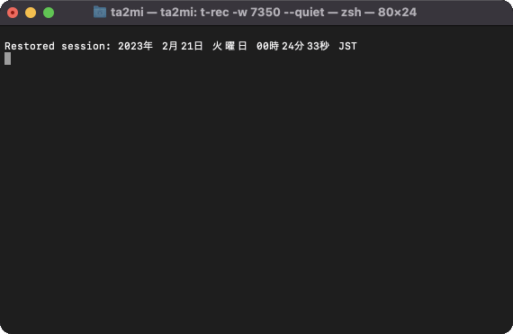

# AWS Profile Switcher by Golang



## Installation

```shell
$ go install github.com/ta2min/go-awsp@latest
```

Add the following to ~/.bashrc or ~/.zshrc 
```shell
$ alias gwsp="source <(go-awsp init)"
```

## Usage

```shell
$ gwsp
```
